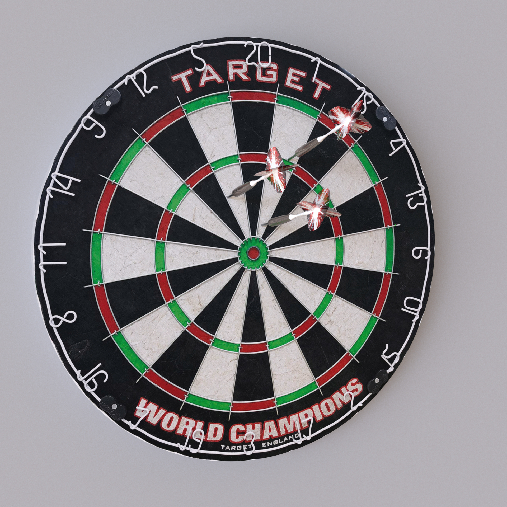

# 🎯 DartNet - AI-Powered Dart Scoring System

<div align="center">


[](https://github.com/yourusername/DartNet)
[](LICENSE)
[](https://www.python.org/downloads/)

**An experimental computer vision system for automatic dart scoring using deep learning**

[Features](#-features) • [Installation](#-installation) • [Usage](#-usage) • [Architecture](#-architecture) • [Contributing](#-contributing)

</div>

---

## 🚧 Project Status

> **⚠️ WORK IN PROGRESS**: This project is under active development and is not production-ready. Expect breaking changes and incomplete features.

## 📖 About

DartNet is an innovative AI-powered system that automatically detects and scores dart throws using computer vision and deep learning. The project combines synthetic data generation, real-time video analysis, and various detection methods to create a comprehensive dart scoring solution.

### 🎯 Key Components

- **3D Synthetic Data Generator** - Creates realistic training data using Blender
- **YOLO-based Detection** - Multiple trained models for dart tip detection
- **Multi-method Impact Detection** - Accelerometer, video delta, and pure video analysis
- **Real-time Scoring GUI** - Interactive interface with sound effects
- **Hardware Integration** - Support for GranBoard and custom sensors

## ✨ Features

### Current Capabilities

- ✅ **3D Data Generation** - Photorealistic synthetic dartboard and dart renders
- ✅ **Multiple Detection Models** - Various YOLO models for different scenarios
- ✅ **Impact Detection** - Multiple methods including accelerometer and video analysis
- ✅ **GUI Scorer** - Basic scoring interface with game logic
- ✅ **Sound System** - Audio feedback for hits and game events
- ✅ **MQTT Integration** - Real-time communication with sensors

### 🚧 Known Limitations

- ❌ Detection accuracy needs improvement
- ❌ Limited to specific board configurations
- ❌ Requires manual calibration for new environments
- ❌ Performance optimization needed
- ❌ Multi-player support incomplete

## 🛠️ Installation

### Prerequisites

- Python 3.8 or higher
- OpenCV
- CUDA-capable GPU (recommended for real-time inference)
- Webcam or IP camera
- (Optional) Accelerometer sensor with MQTT support

### Setup

1. **Clone the repository**

   ```bash
   git clone https://github.com/yourusername/DartNet.git
   cd DartNet
   ```

2. **Create a virtual environment**

   ```bash
   python -m venv venv
   source venv/bin/activate  # On Windows: venv\Scripts\activate
   ```

3. **Install dependencies**

   ```bash
   pip install -r requirements.txt
   ```

4. **Download pre-trained models** (if available)
   ```bash
   # Models should be placed in the root directory
   # best_s_tip_boxes640_B.pt
   # best_temporal_A.pt
   # etc.
   ```

## 🚀 Usage

### Quick Start

1. **Generate Training Data** (Optional)

   ```bash
   python generator/gen_dataset.py --num-images 1000
   ```

2. **Run the Dart Scorer**

   ```bash
   python scorer_gui.py
   ```

3. **Live Detection Demo**
   ```bash
   python live.py
   ```

### Advanced Usage

#### Using Different Detection Methods

```python
# Accelerometer + Video
python dart_impact_detector.py

# Video-only detection
python live.py --detector video-only
```

#### Training Custom Models

```bash
python train.py --dataset ./dataset --epochs 100
```

## 🏗️ Architecture

### System Overview

```
┌─────────────────┐     ┌──────────────────┐     ┌─────────────────┐
│  Video Capture  │────▶│ Impact Detection │────▶│  Dart Scoring   │
│   (Webcam/IP)   │     │  (Multi-method)  │     │     Engine      │
└─────────────────┘     └──────────────────┘     └─────────────────┘
         │                       │                         │
         ▼                       ▼                         ▼
┌─────────────────┐     ┌──────────────────┐     ┌─────────────────┐
│ YOLO Detection  │     │ MQTT Sensors     │     │   GUI Display   │
│    Models       │     │ (Accelerometer)  │     │  Sound Effects  │
└─────────────────┘     └──────────────────┘     └─────────────────┘
```

### Key Modules

- **`dart_impact_detector.py`** - Multi-method impact detection system
- **`target_detector.py`** - YOLO-based dart tip detection
- **`scorer_gui.py`** - Game scoring logic and GUI
- **`generator/`** - 3D synthetic data generation pipeline
- **`tools.py`** - Utility functions for image processing

## 📸 Screenshots

<details>
<summary>View Screenshots</summary>

### Detection in Action

_Coming soon..._

### Scorer GUI

_Coming soon..._

### 3D Generator Output



</details>

## 🗺️ Roadmap

### Phase 1: Core Functionality (Current)

- [x] Basic detection pipeline
- [x] Simple scoring GUI
- [ ] Improve detection accuracy to 95%+
- [ ] Add calibration wizard

### Phase 2: Enhanced Features

- [ ] Multi-player support
- [ ] Game variants (Cricket, Around the Clock)
- [ ] Statistics tracking
- [ ] Online leaderboards

### Phase 3: Advanced Integration

- [ ] Mobile app companion
- [ ] Voice announcements
- [ ] Tournament mode
- [ ] AR visualization

## 🤝 Contributing

We welcome contributions! This project is in early development, so there are many opportunities to help.

### How to Contribute

1. Fork the repository
2. Create a feature branch (`git checkout -b feature/AmazingFeature`)
3. Commit your changes (`git commit -m 'Add some AmazingFeature'`)
4. Push to the branch (`git push origin feature/AmazingFeature`)
5. Open a Pull Request

### Areas Needing Help

- 🎯 Improving detection accuracy
- 📊 Adding more game modes
- 🎨 UI/UX improvements
- 📝 Documentation
- 🧪 Testing and bug fixes

## 📄 License

This project is licensed under the MIT License - see the [LICENSE](LICENSE) file for details.

## 🙏 Acknowledgments

- YOLOv8 by Ultralytics for object detection
- OpenCV community for computer vision tools
- Blender for 3D rendering capabilities
- All contributors and testers

## 📞 Contact

For questions or suggestions, please open an issue on GitHub.

---

<div align="center">
Made with ❤️ for the darts community
</div>
